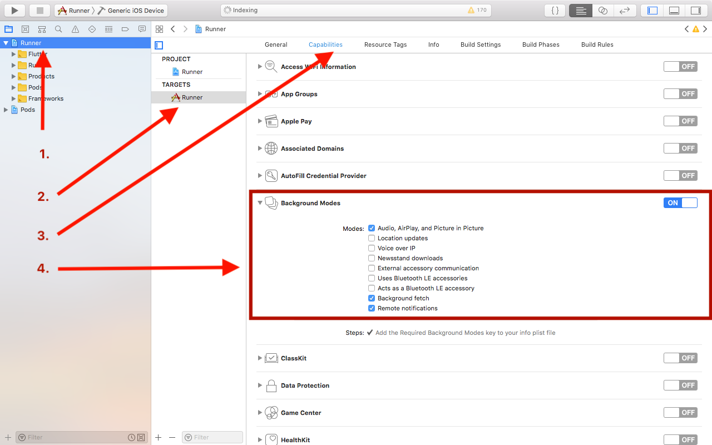
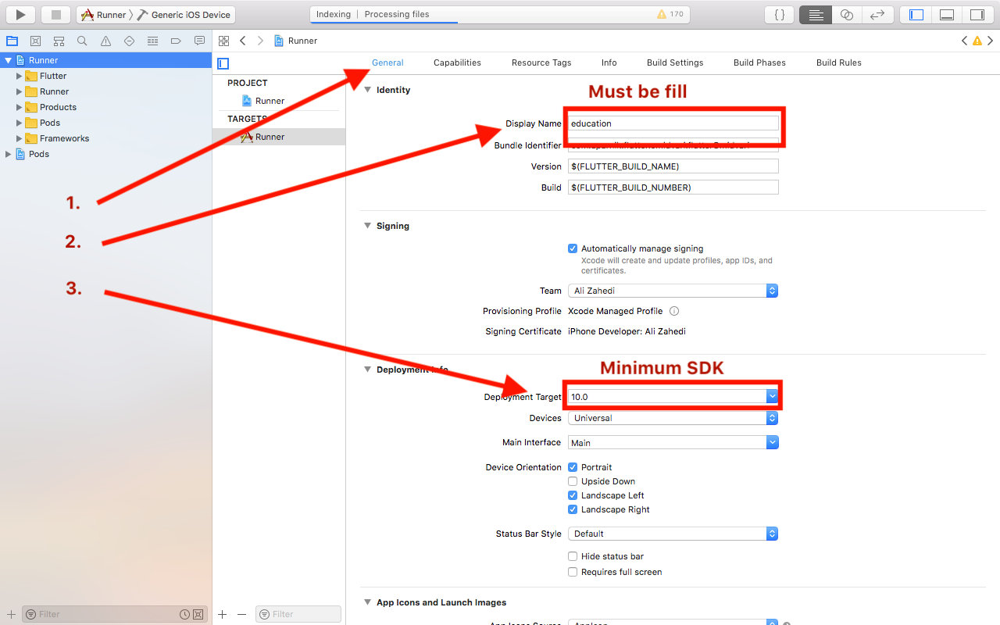

# az_player_plugin

A flutter player plugin for Android and iOS.

This plugin handle background mode playing, for music and video.

Add notification player in notification center and lock screen. Support both android/iOS.

## Getting Started

This project is a starting point for a Flutter
[plug-in package](https://flutter.dev/developing-packages/),
a specialized package that includes platform-specific implementation code for
Android and/or iOS.

For help getting started with Flutter, view our 
[online documentation](https://flutter.dev/docs), which offers tutorials, 
samples, guidance on mobile development, and a full API reference.

### Android

#### Step 1. `android/app/AndroidManifest.xml`

1.1. add code below:

> `<service android:name="pro.zahedi.flutter.plugin.player.az_player_plugin.AudioService"
     android:enabled="true"
     android:exported="false">
 </service>`
 
1.2. in `Application` section:

> `android:usesCleartextTraffic="true"`

1.3. in `Application` section, add the permission for foreground service:

> `<uses-permission android:name="android.permission.FOREGROUND_SERVICE" />`

#### Step 2. `android/app/build.graddle`

2.1. Add the following dependency

> `android { compileOptions {
                    sourceCompatibility JavaVersion.VERSION_1_8
                    targetCompatibility JavaVersion.VERSION_1_8
                }
        }`

#### Troubleshooting        
##### Android X compatibility. 

If you have an error about android x compatibility, please visit the [Flutter AndroidX compatibility](https://flutter.dev/docs/development/packages-and-plugins/androidx-compatibility). 

### iOS

#### Step 1. Background mode

Active background mode in show as a picture:

#### Step 2. `ios/Runner/Info.plist`

Before the `</dict>
            </plist>` add:
            
2.1. Allow access the internet for play link:

> `
<key>NSAppTransportSecurity</key>
      <dict>
        <key>NSAllowsArbitraryLoads</key>
        <true/>
      </dict>
      `
      
2.2. Allow show embedded flutter view:

> `
<key>io.flutter.embedded_views_preview</key>
        <true/>
        `
        
#### Step 3. 

3.1. Choose the application name.

3.2. Minimum `SDK` is `10.0` 

#### Troubleshooting

The base flutter project must be `swift` project.

If you want to migrate to `swift` project from `objective-c`. It's easy, you can follow this step in [Stack overflow](https://stackoverflow.com/questions/58231734/flutter-migrate-objective-c-project-to-swift-project-error-when-use-swift-plugi/58231735#58231735)

### Usage

See [here](example/README.md) for usage.

#### TODO:

- [ ] get play list

- [ ] fast forward in iOS

- [ ] fast backward in iOS

- [ ] handle update client. like call back or interval for update timer, slider, play/pause button in framework.

## Please rate/star and contribute if you find it helpfull.